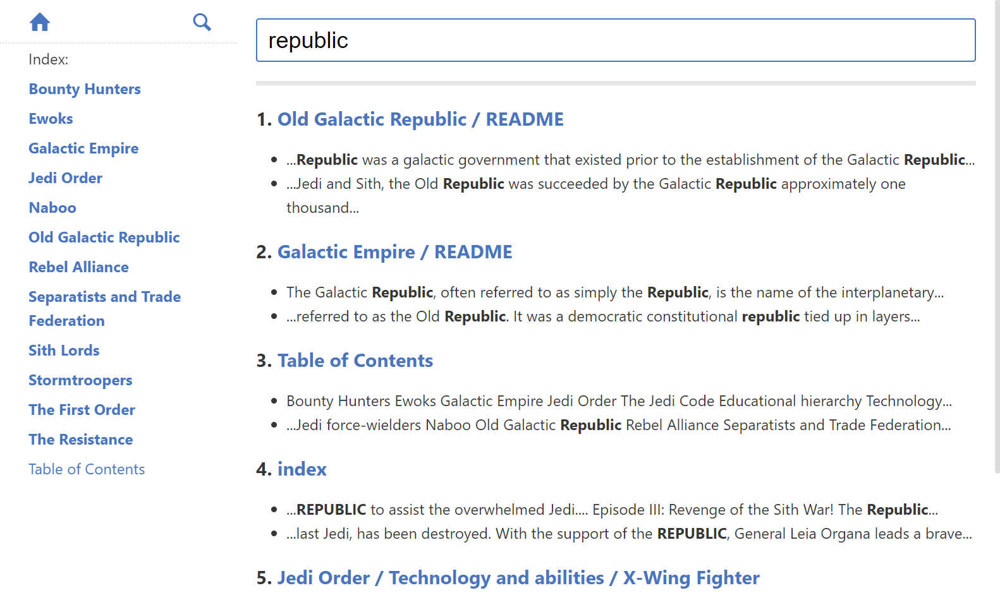

# Madness - Instant Markdown Server

[](https://badge.fury.io/rb/madness)
[](https://github.com/DannyBen/madness/actions?query=workflow%3ATest)
[](https://codeclimate.com/github/DannyBen/madness/maintainability)

---

## Screenshots (click to zoom)

<table><tr>
  <td><a target='_screenshot' href='assets/screen-main.png'></a></td>
  <td><a target='_screenshot' href='assets/screen-nav.png'></a></td>
  <td><a target='_screenshot' href='assets/screen-code.png'></a></td>
  <td><a target='_screenshot' href='assets/screen-search.png'></a></td>
</tr></table>

## Table of Contents

* [Install](#install)
* [Design Intentions](#design-intentions)
* [Feature Highlights](#feature-highlights)
* [Usage](#usage)
* [Directory Conventions](#directory-conventions)
* [Configuration File](#configuration-file)
* [Search](#search)
* [Images and Static Files](#images-and-static-files)
* [Automatic H1](#automatic-h1)
* [Shortlinks](#shortlinks)
* [Table of Contents Generation](#table-of-contents-generation)
* [Hidden Directories](#hidden-directories)
* [Controlling Sort Order](#controlling-sort-order)
* [Displaying Additional File Types](#displaying-additional-file-types)
* [Basic Authentication](#basic-authentication)
* [Customizing Theme](#customizing-theme)
* [Docker Image](#docker-image)

## Install

**Using Ruby:**

```shell
$ gem install madness
```

**Using Homebrew:**

```shell
$ brew install brew-gem
$ brew gem install madness
```

**Using Docker:**

```shell
$ alias madness='docker run --rm -it -v $PWD:/docs -p 3000:3000 dannyben/madness'
```

## Design Intentions

Madness was designed in order to provide easy browsing, viewing and 
searching for local, markdown based documentation directories.

## Feature Highlights

- Easy to use.
- Built-in full text search.
- Compatible with how markdown files are displayed on GitHub and GitHub pages.
- Configure with a configuration file or command arguments.
- Fully customizable theme.
- Automatic generation of navigation sidebar.
- Automatic generation of Table of Contents (site-wide and inline).
- Can optionally show additional file types in the navigation menu (e.g. PDF files).
- Optional support for `[[Short Link]]` syntax.

## Usage

Go to any directory that contains markdown files and run:

```shell
$ madness
```

And open <http://localhost:3000> in your browser.

For more options, run:

```shell
$ madness --help
```

## Directory Conventions

Madness expects to be executed in a documentation directory.

A documentation directory contains only markdown files (`*.md`) and 
sub directories that contain more markdown files.

The server will consider the file `index.md` or `README.md` in any directory 
as the main file describing this directory, where `index.md` has priority.

The navigation sidebar will show all the sub directories and files in 
the same directory as the viewed file.

Example structure:

```
./
├── README.md
├── File.md
├── Another File.md
├── Folder
│   ├── File.md
│   └── image.png
└── Another Folder
    ├── README.md
    └── File.md
```

## Configuration File

All the command line arguments can also be configured through a 
configuration file. Create a file named `.madness.yml` in your 
documentation directory, and modify any of the settings below.

```yaml
# .madness.yml

# path to the documentation root
path: .

# server port
port: 3000

# server listen address
bind: 0.0.0.0

# enable sidebar
sidebar: true

# add H1 title to files that do not have one
auto_h1: true

# append navigation to directory READMEs
auto_nav: true

# enable syntax highlighter for code snippets
highlighter: true

# enable line numbers for code snippets
line_numbers: true

# enable the copy to clipboard icon for code snippets
copy_code: true

# convert [[Links]] to [Links](Links)
shortlinks: false

# generate a table of contents file with this name, for example:
# toc: Table of Contents
toc: ~

# path to theme folder, for example:
# theme: _theme
theme: ~

# open the server URL in the browser
open: false

# provide user:password for basic authentication, for example:
# auth: admin:s3cr3t
auth: false

# if auth is enabled, specify auth realm name
auth_zone: Madness

# show files with these extensions in the navigation and search, for example:
# expose_extensions: pdf,docx,xlsx,txt
expose_extensions: ~

# exclude directories that match these regular expressions
# note that this is an array
exclude: ['^[a-z_\-0-9]+$']
```

For convenience, you can generate a template config file by running:

```shell
$ madness create config
```

## Search

Madness comes with a full text search page.

## Images and Static Files

You can put images and other asset files anywhere in your documentation
folder.

When linking to other pages or images in your documentation folder, simply
use the URL relative to the markdown file. 

For example, if you have a folder named `subfolder` that contains a 
`README.md` and a `nice-picture.png`, showing it in your `README` is done by
this markdown:

```markdown

```

If you wish to link to images or pages in a different folder, simply specify
the path relative to the homepage:

```markdown

```

## Automatic H1

If your markdown document does not start with a level 1 heading, it
will be automatically added based on the file name.

## Shortlinks

When the `shortlinks` option is enabled, you may use a shorthand syntax for 
specifying internal links, where `[[Anything]]` will be converted to
`[Anything](Anything)`, which will then be rendered as an internal link to a
file or a directory in the same directory as the file itself.

## Table of Contents Generation

### Site-wide

To generate a Table of Contents file for the entire site (for the directories
and files), run `madness --toc FILENAME`

### Inline

If you have long markdown documents, and you wish to add an inline Table of
Contents for them, simply add an HTML comment `<!-- TOC -->` where you want
the Table of Contents to be generated. The inserted list will only consider
H2 and H3 headings.

## Hidden Directories

Directories that are made only of lowercase letters, underscoes, dash and/or
numbers (`/^[a-z_\-0-9]+$/`) will not be displayed in the navigation. In
other words, directories must have at least one uppercase letter or a space
to be recognized as a documentation directory.

This can be configured by using the `exclude` configuration option:

```yaml
# do not ignore any directory
exclude: ~

# ignore only specific directories
exclude: [assets, public]

# ignore using regular expressions
exclude: ['^public$', 'assets']
```

## Controlling Sort Order

To control the sort order of the automatically generated navigation elements,
simply prefix your files and directories with digits followed by a dot and a 
space, just like you would create an ordered list in Markdown. The numbers
will be omitted when they are displayed.

```
./
├── 1. Some file or folder
└── 2. Another file or folder
```

## Displaying Additional File Types

If you wish the navigation and search features to also show other documents
and files (for example, PDF files), you may configure the `expose_extensions`
option in the configuration file to contain a comma delimited list of
extensions:

```yaml
expose_extensions: pdf,docx,xlsx,txt
```

The default value of this option is `null` (or `~`, which is `null` in YAML).

## Basic Authentication

To add basic authentication, use the `--auth user:password` command line argument or the equivalent `auth` configuration option.

If you wish to avoid storing the basic authentication credentials in the configuration file, you may use ERB tags to load the credentials from environment variables:

```yaml
auth: <%= ENV['BASIC_AUTH'] %>
```

## Customizing Theme

There are two ways to change how Madness looks. 


### Option 1: Change CSS and HTML (Slim)

In order to have complete control over the CSS and generated HTML, you
can override the views and styles. Views are provided as Slim templates, 
and CSS is provided as SCSS.

Madness comes with a command that copies the default theme to a folder of
your choice, where you can customize it to your taste. Run:

```shell
$ madness create theme my_theme
```

Where `my_theme` is the folder that will be created.

To use the created theme, simply run Madness with the `--theme my_theme`
option.

```shell
$ madness --theme my_theme
```

Note that the generated theme contains the SCSS files in the `styles`
subfolder, and the rendered CSS files in the `public/css` subfolder.

If you wish to use the SCSS files, you will need to render them yourself
to the location of your theme styles (e.g. `public/css`) - you can use
any tool to do so, or if you do not have a preference, use
[SassTool][sasstool].


### Option 2: Change CSS only

If you are looking to implement a smaller CSS change, follow these steps:

- Create a directory named `css` in your root documentation directory.
- Copy the [main.css][css] file to it.
- Update it as you see fit.

Note that this functionality is not guaranteed to stay as is in future 
versions of madness.

## Docker Image

Madness server is also available as a docker image.

This command will start the server on localhost:3000, with the current 
directory as the markdown documentation folder

```shell
$ docker run --rm -it -v $PWD:/docs -p 3000:3000 dannyben/madness
```

You may create an alias for convenience:

```shell
$ alias madness='docker run --rm -it -v $PWD:/docs -p 3000:3000 dannyben/madness'
$ madness --help
```

For more information about the docker image, see:

- [Madness image on Docker Hub][dockerhub]
- [Madness Dockerfile and Docker Compose][dockerfile]


---

[dockerhub]: https://hub.docker.com/r/dannyben/madness/
[dockerfile]: https://github.com/DannyBen/docker-madness
[css]: app/public/css/main.css
[app]: app
[sasstool]: https://github.com/DannyBen/sasstool

