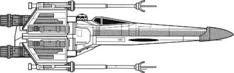

X-Wing Fighter
==================================================



## Usage

```ruby
planets = Starwars::Planet.fetch_all

# to access the items use #items
planets.items.map(&:name)
planets.items.each{|item| p item.inspect}

# you can also use #results instead of iteams
planets.results.map(&:name)
```

The X-wing starfighter is a fictional spacecraft from the original and sequel Star Wars trilogies and the Star Wars expanded universe. They are depicted as the primary space superiority interceptor and dogfighter of the Rebel Alliance, the New Republic and the Resistance. The craft has been merchandised as a variety of toys, models licensed for use in games, novels and comics.
